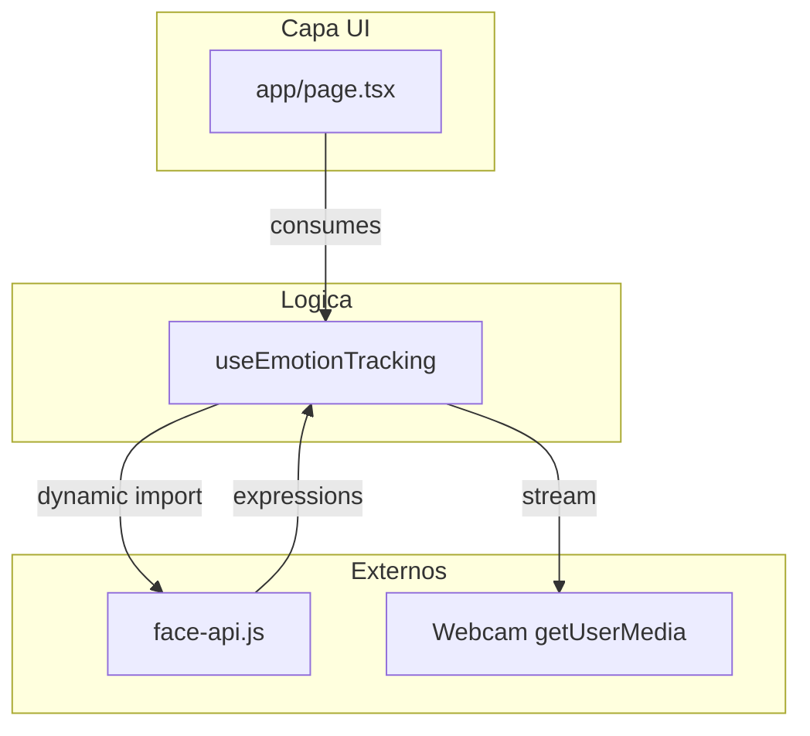
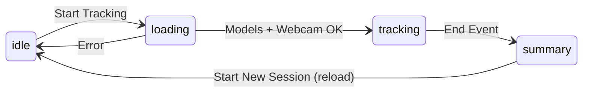

# Event Mood Tracker

Aplicacion web que detecta el estado de animo de la audiencia en tiempo real mediante analisis de expresiones faciales por webcam. Todo el procesamiento ocurre en el cliente; no se almacenan videos ni imagenes.

## Caracteristicas principales

- **Deteccion de emociones en tiempo real**: happy, neutral, surprised, sad, angry.
- **Webcam**: uso de la camara del dispositivo; modelos de ML (face-api.js) cargados desde CDN.
- **Privacidad**: solo se mantienen estadisticas agregadas en memoria; no se guardan videos ni imagenes.
- **Flujo en cuatro estados**: idle, loading, tracking, summary.

## Stack tecnologico

| Categoria   | Tecnologia |
|------------|------------|
| Framework  | Next.js 16 (App Router), React 19 |
| Lenguaje   | TypeScript |
| Estilos    | Tailwind CSS 3.x, variables CSS (tema en `app/globals.css`) |
| UI         | Componentes shadcn/ui (Radix UI), iconos Lucide |
| Deteccion  | face-api.js (TinyFaceDetector + FaceExpressionNet), modelos desde CDN |
| Paquetes   | bun (recomendado) |

La configuracion de componentes UI esta en `components.json`. La URL de modelos y la logica de deteccion estan en `hooks/use-emotion-tracking.ts`.

## Arquitectura de alto nivel



**Flujo de estados:**



- **idle**: pantalla inicial; boton para iniciar.
- **loading**: carga de modelos face-api.js y solicitud de permiso de webcam.
- **tracking**: video en vivo y loop de deteccion (~500 ms); contadores y porcentajes en memoria.
- **summary**: resumen (total de detecciones, emocion dominante, desglose por emocion); boton para nueva sesion.

Los datos se mantienen en el hook: `emotionCounts` (contadores por emocion), `emotionPercentages` y `dominantEventEmotion` se derivan de esos contadores.

## Estructura del proyecto

| Ruta | Descripcion |
|------|-------------|
| `app/` | Layout raiz, pagina principal, estilos globales (App Router) |
| `app/layout.tsx` | Layout y metadata (titulo, descripcion) |
| `app/page.tsx` | Pagina unica: estados idle, loading, tracking, summary |
| `app/globals.css` | Variables CSS y Tailwind |
| `components/` | theme-provider y componentes UI (shadcn) |
| `hooks/use-emotion-tracking.ts` | Nucleo: carga de modelos, webcam, loop de deteccion, contadores y estados |
| `lib/utils.ts` | Utilidades (ej. cn para clases) |
| `public/` | Assets estaticos |

## Como ejecutar el proyecto

**Requisitos:**

- Node.js o bun.
- Navegador con soporte para `getUserMedia` (acceso a webcam). HTTPS o localhost requerido para la camara.

**Comandos (con bun):**

```bash
bun install
bun run dev
```

- Desarrollo: por defecto en `http://localhost:3000`.
- Produccion: `bun run build` y luego `bun run start`.

## Consideraciones

- **Privacidad**: toda la logica corre en el cliente; no hay backend ni persistencia de video.
- **Dependencia externa**: los modelos de face-api.js se cargan desde un CDN; el uso offline es limitado hasta que el navegador los tenga en cache.
- **Navegador**: el acceso a la camara exige contexto seguro (HTTPS o localhost).
